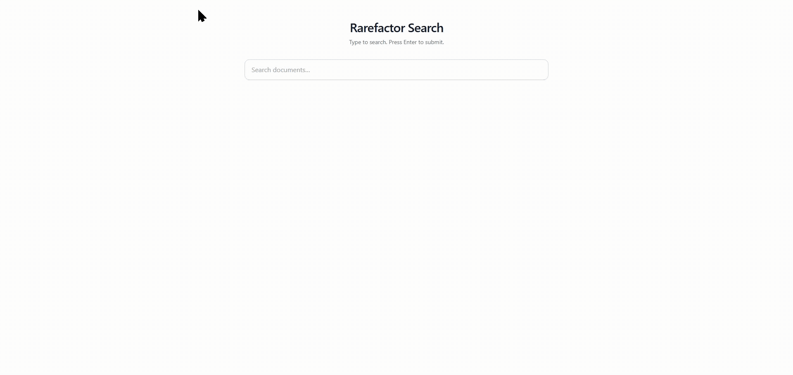
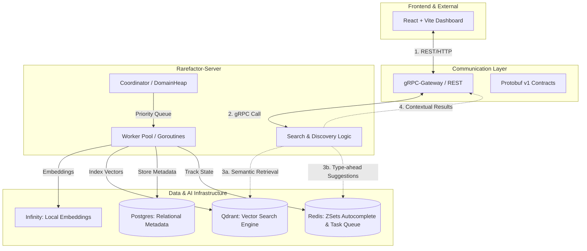

# Rarefactor



Rarefactor is a high-performance search engine and crawler architecture, recently refactored from a Python MVP into a Go-based system. It features a modern React (Vite + TypeScript + Tailwind CSS v3) client.

## Project Status
Rarefactor is currently in Phase 1: High-Quality Foundation. We have successfully refactored the Python MVP into a high-performance Go-based architecture. For a detailed look at future phases, see the [ROADMAP.md](./ROADMAP.md).

## Getting Started

### System Architecture

### Prerequisites
- Go 1.21+
- Node.js 18+
- Docker & Docker Compose

### 1. Infrastructure
Start Postgres, Redis, Qdrant, and the Embeddings engine with:
```bash
docker-compose up -d
```
*Note: The `server` service in `docker-compose.yml` builds the Go backend. You can either run the whole stack via Docker or run the infrastructure and then start the backend manually for development.*

### 2. Backend (Manual/Development)
If you prefer to run the Go server manually (after starting infrastructure):
```bash
cd backend
go run cmd/server/main.go
```

### 3. Frontend
Navigate to the `client` directory and start the development server:
```bash
cd client
npm install
npm run dev
```

### 4. Initial Crawl
To trigger an initial crawl, use the following `Invoke-RestMethod` command (PowerShell) to hit the gRPC-Gateway endpoint:
```powershell
Invoke-RestMethod -Method Post -Uri "http://localhost:8000/v1/crawl" -Body '{"seed_url": ["https://example.com"]}'
```

## Sub-application READMEs
- See [backend/README.md](./backend/README.md) for backend technologies, architecture, and endpoints.
- See [client/README.md](./client/README.md) for frontend stack (React + Vite + Tailwind), components, and scripts.

